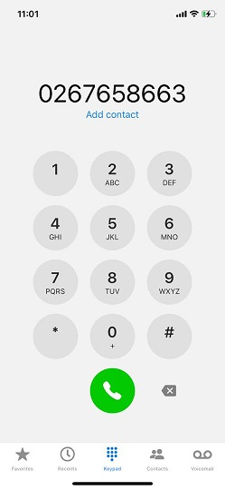
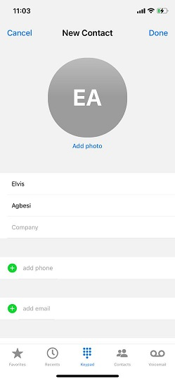
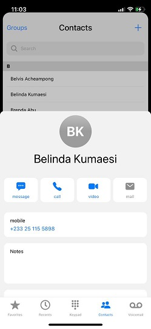
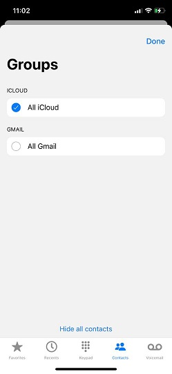

### Phone Dialer
----------
This is a project meant to build my React Native skills to a much more proficient level

In this project I clone the iOS phone app with

Goals
----------
1. Create a phone dialer component (completed)
2. Learn how to create a multilayout app using a navigation component (completed)
3. Learn how to create popup cards (completed)
4. Explore the various components for creating lists, FlatList, Section list (completed)
5. Use the device media to store some data (Completed in another app [here](https://github.com/LighteningCode/e-note) )
6. Use an animation library to make some animations work (normal fades and some movements)
7. Make some searching work somewhere
8. Create a component and dynamically load data when a clicked. (completed)
9. Play sound from the app and enable haptics (completed)

#### Here is my build for the app

Dialer screen

Add new contact screen

View user screen

Contact groups screen

if you use an iphone go and check out these screens if they resemble each other. ik ik they do 😃